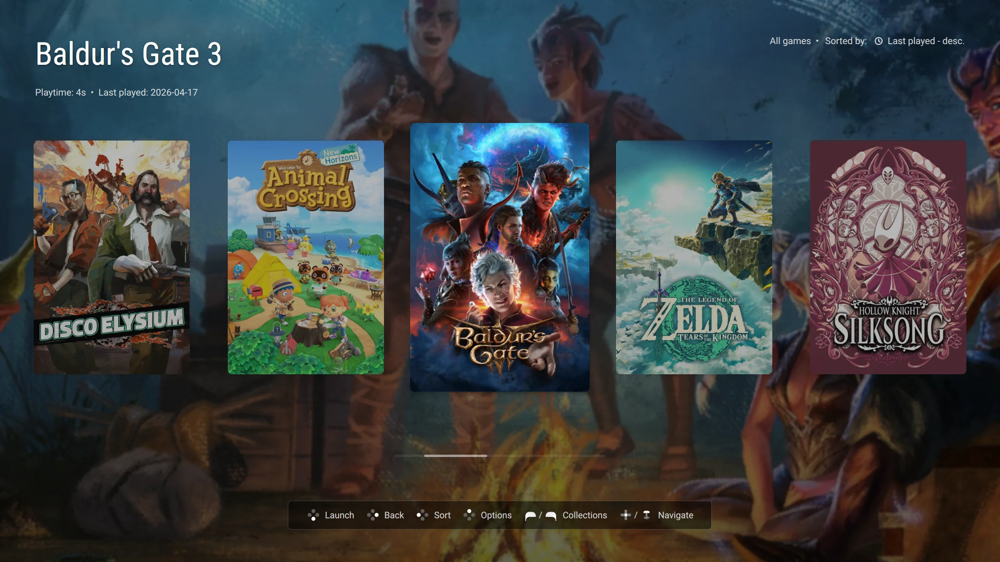
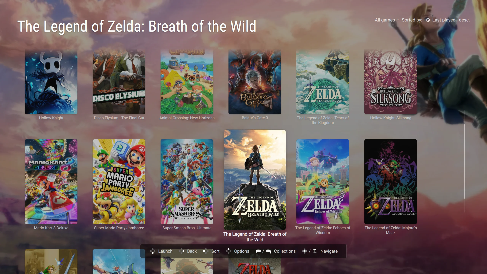
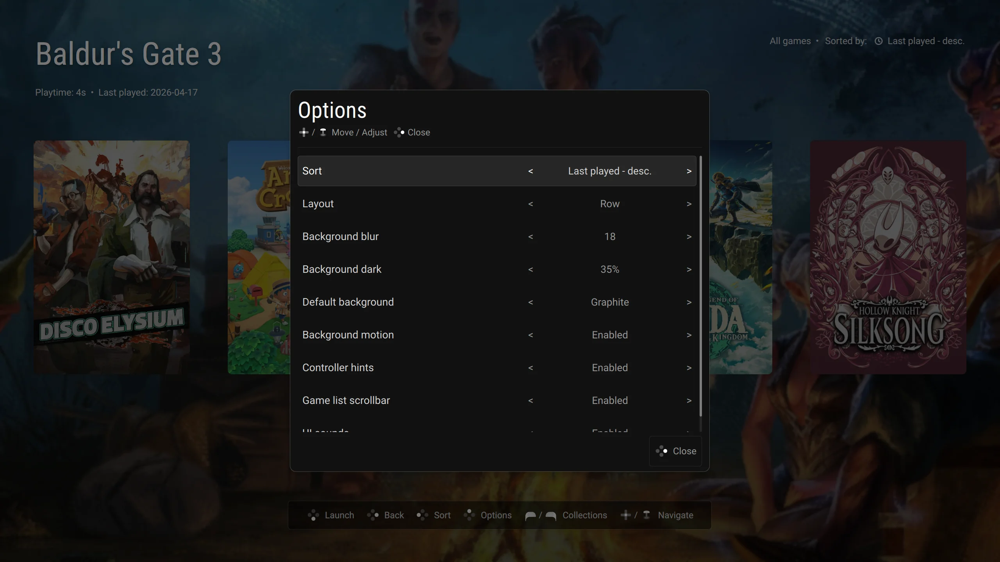

# Clean Covers

Simple [Pegasus Frontend](https://pegasus-frontend.org/) theme focused on cover art, blurred backdrops, and clean browsing for a laid-back gaming experience.

## Screenshots

## Features

- Row and grid layouts
- Sort by last played, title, release year, play count, and play time
- Collection switching
- Persistent theme settings
- Blurred and darkened backdrop with optional motion
- Optional controller hints, scrollbar, and UI sounds

## Installation

Clone this repository or [download as zip](https://github.com/mlumeau/pegasus-theme-clean-covers/archive/main.zip) and extract this directory into your Pegasus themes folder:

- Linux: `~/.config/pegasus-frontend/themes/dark-carousel`
- Windows: `%APPDATA%/pegasus-frontend/themes/dark-carousel`
- macOS: `~/Library/Application Support/pegasus-frontend/themes/dark-carousel`

Then select `Clean Covers` theme in Pegasus Frontend.

## Artwork Behavior

The theme prefers these assets when available:

- Covers: `poster`, then `boxFront`, then `tile`
- Backgrounds: `banner`, `steam`, `background`, `screenshot`, then `titlescreen`

When no suitable art is available, the theme falls back to a built-in poster placeholder and a configurable background color.

## Theme Options

The in-theme options menu supports:

- Sort mode
- Layout mode
- Background blur strength
- Background darkening
- Fallback background color
- Background motion toggle
- Controller hints toggle
- Scrollbar toggle
- UI sounds toggle

## Notes

This theme is intentionally narrow in scope. It focuses on a clean browsing and launch experience rather than advanced library management features such as search, filters, favorites workflows, or video backgrounds.

## License

This project is licensed under the MIT License. See [LICENSE](LICENSE).
